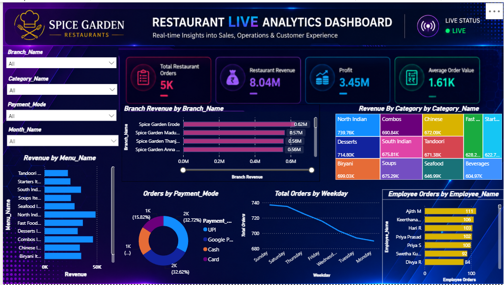

#  Restaurant Live Analytics Dashboard | Power BI

> An interactive Business Intelligence dashboard built using **Microsoft Power BI** to analyze restaurant sales, revenue, customer behavior, menu performance, employee productivity, and payment trends.

---

#  Dashboard Preview
<p align="center">
  
</p>
</p>

---

#  Project Overview

The **Restaurant Live Analytics Dashboard** transforms restaurant operational data into meaningful business insights through interactive reports and visualizations. It enables restaurant managers and stakeholders to monitor KPIs, compare branch performance, identify top-selling menu items, evaluate employee productivity, and make data-driven decisions.

---

#  Business Objectives

- Monitor restaurant sales performance.
- Analyze revenue across restaurant branches.
- Identify the highest-performing menu categories.
- Compare payment methods used by customers.
- Track employee order handling performance.
- Discover weekly ordering trends.
- Improve business decision-making through interactive dashboards.

---

#  Key Performance Indicators (KPIs)

| KPI | Value |
|------|------:|
| 🍽️ Total Restaurant Orders | **5K** |
| 💰 Restaurant Revenue | **8.04M** |
| 📈 Profit | **3.45M** |
| 🧾 Average Order Value | **1.61K** |

---

#  Dashboard Features

###  Interactive Slicers

- Branch
- Category
- Payment Mode
- Month

###  Visualizations

- Branch Revenue Analysis
- Revenue by Category
- Revenue by Menu
- Orders by Payment Mode
- Total Orders by Weekday
- Employee Orders Analysis

###  KPI Cards

- Total Restaurant Orders
- Restaurant Revenue
- Profit
- Average Order Value

---

#  Data Model

The dashboard follows a **Star Schema**.

```
                 Dim_Date
                     │
Dim_Branch ─── Fact_Restaurant_Orders ─── Dim_Customer
                     │
         ┌───────────┼───────────┐
         │           │           │
     Dim_Menu   Dim_Category   Dim_Employee
                     │
             Dim_Promotion
```

---

#  Dataset

The project consists of the following tables:

- Fact_Restaurant_Orders
- Dim_Branch
- Dim_Category
- Dim_Customer
- Dim_Date
- Dim_Employee
- Dim_Menu
- Dim_Promotion

---

#  Business Questions Answered

- Which restaurant branch generates the highest revenue?
- Which menu category contributes the highest revenue?
- Which payment mode is preferred by customers?
- Which employee handles the maximum number of orders?
- Which weekday receives the highest number of restaurant orders?
- Which menu items generate the highest revenue?

---

#  Key Business Insights

-  Branch revenue comparison identifies top-performing branches.
-  North Indian and Combo meals contribute significantly to overall revenue.
-  Digital payment methods are preferred over cash transactions.
-  Employee performance varies across branches.
-  Weekend ordering trends differ from weekdays.
-  Revenue contribution can be analyzed by menu category and branch.

---

#  Tools & Technologies

- Microsoft Power BI
- Power Query
- DAX
- Data Modeling
- Star Schema
- Microsoft Excel

---

#  Skills Demonstrated

- Data Cleaning
- Data Transformation
- Data Modeling
- DAX Measures
- KPI Development
- Dashboard Design
- Interactive Reporting
- Business Intelligence
- Data Visualization
- Business Storytelling

---

#  Future Enhancements

- Real-Time Dashboard Refresh
- Sales Forecasting
- Customer Segmentation
- Inventory Analytics
- Business Insights Page
- Mobile Responsive Dashboard
- AI Smart Narrative
- Drill-through Reports

---

#  Repository Structure

```
Restaurant-Live-Analytics-Dashboard/
│
├── Restaurant Dashboard.pbix
├── Fact_Restaurant_Orders.xlsx
├── Dim_Branch.xlsx
├── Dim_Category.xlsx
├── Dim_Customer.xlsx
├── Dim_Date.xlsx
├── Dim_Employee.xlsx
├── Dim_Menu.xlsx
├── Dim_Promotion.xlsx
├── dashboard.png
├── README.md
└── Screenshots/
```

---

#  Dashboard Highlights

✅ Professional Dark Theme Dashboard

✅ Interactive Slicers

✅ Dynamic KPI Cards

✅ Branch-wise Revenue Analysis

✅ Category Performance Analysis

✅ Employee Performance Tracking

✅ Payment Mode Analysis

✅ Weekly Order Trend Analysis

✅ Star Schema Data Model

---

# 👨 Developed By

**Gnana Jothi**

**Aspiring Data Analyst**

### Skills

- Power BI
- SQL
- Excel
- Python
- DAX
- Power Query
- Data Visualization

---

⭐ If you found this project useful, consider giving this repository a star!